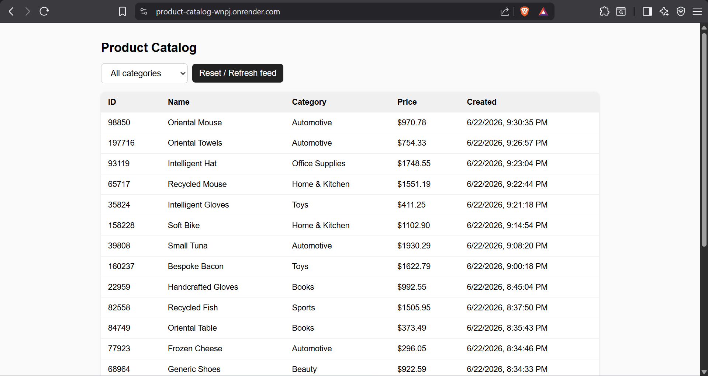
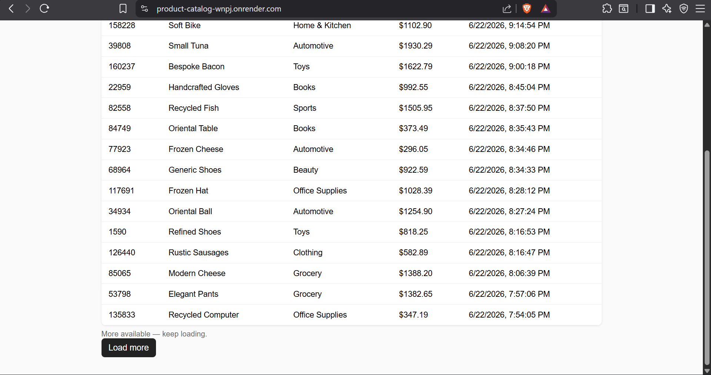
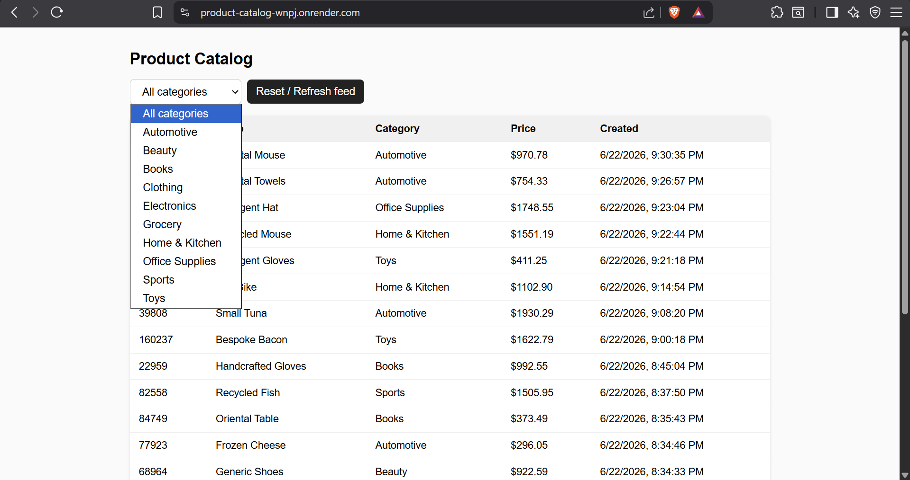

# Product Catalog API

A backend service for browsing approximately 200,000 products with:

- Newest-first ordering
- Category filtering
- Cursor-based pagination
- Stable pagination while data is changing
- PostgreSQL indexing for fast queries

The project was built as part of the CodeVector Internship take-home assignment.

---

## Live Demo

### Backend + UI

https://product-catalog-wnpj.onrender.com

### Health Check

https://product-catalog-wnpj.onrender.com/health

### Products API

https://product-catalog-wnpj.onrender.com/products

### UI Preview

<p align="center">
  
</p>

<p align="center">
  
</p>

<p align="center">
  
</p>

---

## Tech Stack

### Backend

- Node.js
- Express.js

### Database

- PostgreSQL
- Neon (hosted PostgreSQL)

### Data Generation

- Faker.js
- pg-copy-streams

### Bonus UI

- Vanilla HTML
- JavaScript
- CSS

### Development

- Docker
- Postman

---

## Project Structure

```text
product-catalog/
├── Postman_Collection/
│   └── Product Catalog API.postman_collection.json
├── public/
│   └── index.html
├── scripts/
│   └── seed.js
├── src/
│   ├── routes/
│   │   └── products.js
│   ├── db.js
│   └── server.js
├── schema.sql
├── package.json
└── package-lock.json
```

---

## Why PostgreSQL?

The assignment requires:

- Filtering by category
- Sorting by newest products
- Fast pagination
- Correctness while data is changing

PostgreSQL fits these requirements well because composite indexes can efficiently support both filtering and sorting in a single query.

---

## Pagination Strategy

### Why not OFFSET Pagination?

A common implementation is:

```sql
SELECT *
FROM products
ORDER BY created_at DESC
LIMIT 20 OFFSET 40;
```

This has two major problems:

### 1. Performance

As offsets grow, PostgreSQL must scan and discard more rows before returning results.

### 2. Incorrect Results During Writes

Example:

- User loads page 1
- 50 new products are inserted
- User requests page 2 using OFFSET

Rows can shift positions, causing:

- Duplicate products
- Missing products

This violates the assignment requirement.

---

## Cursor Pagination

This project uses keyset (cursor) pagination.

The cursor stores:

```json
{
  "createdAt": "...",
  "id": 123
}
```

encoded as Base64.

The next page query becomes:

```sql
WHERE (created_at, id) < (:cursor_created_at, :cursor_id)
ORDER BY created_at DESC, id DESC
LIMIT 20;
```

This keeps pagination stable because newly inserted rows always appear above the cursor position and never affect pages already visited.

---

## Why Sort by created_at?

The assignment mentions inserts and updates.

Sorting by `updated_at` would allow products to move around while users are browsing.

Example:

- User loads page 1
- An older product is updated
- It moves to the top of the feed
- Users may see duplicates or miss products

Sorting by `created_at` avoids this issue because product position never changes after creation.

The `id` column is used as a tie-breaker when multiple rows share the same timestamp.

---

## Database Indexes

```sql
CREATE INDEX idx_products_cursor
ON products (created_at DESC, id DESC);

CREATE INDEX idx_products_category_cursor
ON products (category, created_at DESC, id DESC);
```

### Purpose

- First index supports newest-first pagination
- Second index supports category-filtered pagination

---

## Query Performance

Verified using `EXPLAIN ANALYZE` against a 200,000-row dataset.

Example results:

### Unfiltered Query

```text
Execution Time: 0.300 ms
```

### Category Filtered Query

```text
Execution Time: 0.270 ms
```

Execution plans confirmed PostgreSQL was using index scans rather than sequential scans.

---

## Data Generation

The assignment required generating approximately 200,000 products.

Generated fields:

- id
- name
- category
- price
- created_at
- updated_at

Instead of inserting rows individually, the seed script uses PostgreSQL COPY through `pg-copy-streams` for bulk loading.

Example result:

```text
200,000 rows inserted in ~25 seconds (Neon)
```

---

## Correctness Verification

I manually tested the exact scenario described in the assignment.

Steps:

1. Fetch first page and save cursor
2. Insert additional products
3. Request the next page using the saved cursor
4. Compare results

Result:

- No duplicate products
- No skipped products
- Fresh page-one requests correctly showed new products

---

## API Endpoints

### Get Products

```http
GET /products
```

Optional query parameters:

```text
limit
category
cursor
```

Example:

```http
GET /products?limit=20&category=Electronics
```

Response:

```json
{
  "data": [],
  "nextCursor": "...",
  "hasMore": true
}
```

---

### Get Categories

```http
GET /categories
```

Response:

```json
{
  "categories": []
}
```

---

### Health Check

```http
GET /health
```

Response:

```json
{
  "status": "ok"
}
```

---

## Running Locally

### 1. Install Dependencies

```bash
npm install
```

### 2. Configure Environment

Create:

```env
DATABASE_URL=<postgres_connection_string>
```

### 3. Create Database Schema

Run:

```sql
schema.sql
```

against PostgreSQL.

### 4. Seed Data

```bash
npm run seed
```

### 5. Start Server

```bash
npm start
```

Server:

```text
http://localhost:3000
```

UI:

```text
http://localhost:3000
```

API:

```text
http://localhost:3000/products
```

---

## Docker Development

The project was developed and tested using PostgreSQL running inside Docker.

Example:

```bash
docker run --name product-db \
-e POSTGRES_USER=postgres \
-e POSTGRES_PASSWORD=postgres \
-e POSTGRES_DB=products \
-p 5432:5432 \
-d postgres:18
```

The backend can connect to either:

- Local PostgreSQL (Docker)
- Neon PostgreSQL

without code changes.

---

## Hosted Deployment

### Database

Neon PostgreSQL

### Backend

Render

### Live URL

https://product-catalog-wnpj.onrender.com

---

## Postman Collection

A Postman collection is included in:

```text
Postman_Collection/
```

for easy API testing.

---

## What I Would Improve With More Time

- Add automated integration tests for cursor pagination
- Sign cursors to prevent client-side manipulation
- Add request validation
- Add API documentation using OpenAPI/Swagger
- Add monitoring and metrics

---

## How I Used AI

I used AI tools primarily for brainstorming implementation approaches, validating design decisions, and accelerating boilerplate development.

The most valuable discussion was around offset pagination versus cursor pagination. After reviewing the suggestions, I verified the behavior myself against a real PostgreSQL database and manually tested the concurrent insert scenario to confirm correctness.

AI helped generate initial structure and implementation ideas, but all major design decisions were validated through testing and experimentation before inclusion in the final solution.
